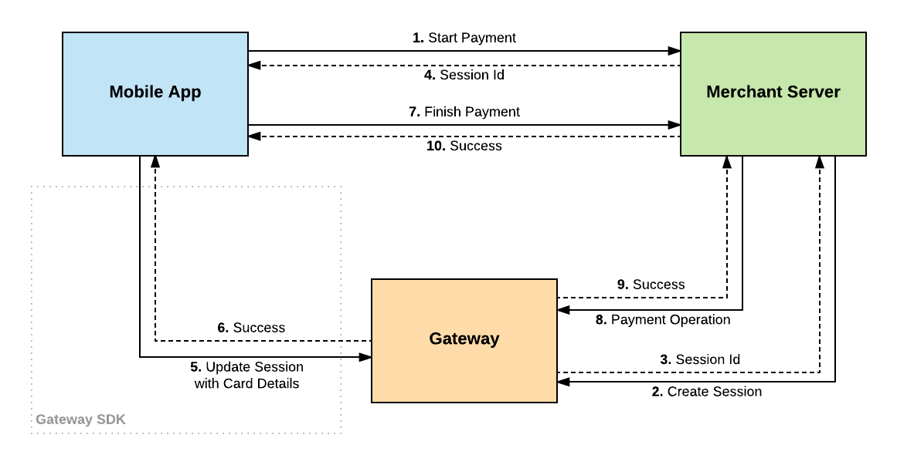

# Gateway Android SDK [](https://travis-ci.org/Mastercard/gateway-android-sdk)

Our Android SDK allows you to easily integrate payments into your Android app. By updating a checkout session directly with the Gateway, you avoid the risk of handling sensitive card details on your server. This sample app demonstrates the basics of installing and configuring the SDK to complete a simple payment.

**\*\*DISCLAIMER: This SDK is currently in pilot phase. Pending a `1.X.X` release, the interface is subject to change. Please direct all support inquiries to your acquirer.**

## Basic Payment Flow Diagram



# Integrating with Your App

## Import the Dependency [](https://bintray.com/mpgs/Android/gateway-android-sdk/_latestVersion) 

This library is hosted in the jCenter repository. To import the Android SDK, include it as a dependency in your build.gradle file. Be sure to replace `{X.X.X}` with the version number in the shield above.

```groovy
implementation 'com.mastercard.gateway:gateway-android:{X.X.X}'
```

## Configuring the SDK

In order to use the SDK, you must initialize the Gateway object with your merchant ID and your gateway's region. If you are unsure about which region to select, please direct your inquiry to your gateway support team.

```java
Gateway gateway = new Gateway();
gateway.setMerchantId("YOUR_MERCHANT_ID");
gateway.setRegion(Gateway.Region.YOUR_REGION);
```

## Updating a Session with Card Information

To help alleviate the worry of passing card information through your servers, the SDK provides a method to update a session with card data directly with the Gateway. Using an existing session ID, you can do so in a couple different ways:

```java
GatewayCallback callback = new GatewayCallback() {
    @Override
    public void onSuccess(GatewayMap response) {
        // TODO handle success
    }
    
    @Override
    public void onError(Throwable throwable) {
        // TODO handle error
    }
};

String sessionId = "...";
String apiVersion = "..."; // must be >= 39

// The GatewayMap object provides support for building a nested map structure using key-based dot(.) notation.
// Each parameter is similarly defined in your online integration guide.
GatewayMap request = new GatewayMap()
    .set("sourceOfFunds.provided.card.nameOnCard", nameOnCard)
    .set("sourceOfFunds.provided.card.number", cardNumber)
    .set("sourceOfFunds.provided.card.securityCode", cardCvv)
    .set("sourceOfFunds.provided.card.expiry.month", cardExpiryMM)
    .set("sourceOfFunds.provided.card.expiry.year", cardExpiryYY);

gateway.updateSession(sessionId, apiVersion, request, callback);
```

Once payer data has been sent, you can complete the Gateway session on your servers with the private API password.


## Rx-Enabled

You may optionally include the **[RxJava2]** library in your project and utilize the appropriate methods provided in the `Gateway` class.

```java
Single<GatewayMap> single = gateway.updateSession(sessionId, apiVersion, request);
```

# Sample App

Included in this project is a sample app that demonstrates how to take a payment using the SDK. This sample app requires a running instance of our **[Gateway Test Merchant Server]**. Follow the instructions for that project and copy the resulting URL of the instance you create.

Making a payment with the Gateway SDK is a three step process.

1. The mobile app uses a merchant server to securely create a session on the gateway.
1. The app prompts the user to enter their payment details and the gateway SDK is used to update the session with the payment card.
1. The merchant server securely completes the payment.

## Initialize the Sample App

To configure the sample app, open the *gradle.properties* file. There are three fields which must be completed in order for the sample app to run a test payment.

```properties
# TEST Gateway Merchant ID
gatewayMerchantId=

# Gateway Region
#   options include: ASIA_PACIFIC, EUROPE, or NORTH_AMERICA
gatewayRegion=

# TEST Merchant Server URL (test server app deployed to Heroku)
# For more information, see: https://github.com/Mastercard/gateway-test-merchant-server
# ex: https://{your-app-name}.herokuapp.com
merchantServerUrl=
```


[RxJava2]: https://github.com/ReactiveX/RxJava
[Gateway Test Merchant Server]: https://github.com/Mastercard/gateway-test-merchant-server
