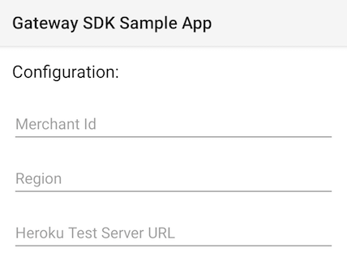

# Gateway Android SDK

[](https://bintray.com/mpgs/Android/gateway-android-sdk/_latestVersion)
[](https://travis-ci.org/Mastercard-Gateway/gateway-android-sdk)

Our Android SDK allows you to easily integrate payments into your Android app. By updating a session directly with the Gateway, you avoid the risk of handling sensitive card details on your server. This sample app demonstrates the basics of installing and configuring the SDK to complete a simple payment.

For more information, visit the [**Gateway Android SDK Wiki**](https://github.com/Mastercard-Gateway/gateway-android-sdk/wiki) to find details about the basic transaction lifecycle and 3-D Secure support.


## Scope

The primary responsibility of this SDK is to eliminate the need for card details to pass thru your merchant service while collecting card information from a mobile device. The Gateway provides this ability by exposing an API call to update a session with card information. This is an "unathenticated" call in the sense that you are not required to provide your private API credentials. It is important to retain your private API password in a secure location and NOT distribute it within your mobile app.

Once you have updated a session with card information from the app, you may then perform a variety of operations using this session from your secure server. Some of these operations include creating an authorization or payment, creating a card token to save card information for a customer, etc. Refer to your gateway integration guide for more details on how a Session can be used in your application.


## Installation

This library is hosted in the jCenter repository. To import the Android SDK, include it as a dependency in your build.gradle file. Be sure to replace `X.X.X` with the version number in the shield above. (Minimum supported Android SDK version 19)

```groovy
implementation 'com.mastercard.gateway:gateway-android:X.X.X'
```

[**Release Notes**](https://github.com/Mastercard-Gateway/gateway-android-sdk/wiki/Release-Notes)


## Configuration

In order to use the SDK, you must initialize the Gateway object with your merchant ID and your gateway's region. If you are unsure about which region to select, please direct your inquiry to your gateway support team.

```java
Gateway gateway = new Gateway();
gateway.setMerchantId("YOUR_MERCHANT_ID");
gateway.setRegion(Gateway.Region.YOUR_REGION);
```


## Basic Implementation

Using an existing Session Id, you may pass card information directly to the `Gateway` object:

```java
// The GatewayMap object provides support for building a nested map structure using key-based dot(.) notation.
// Each parameter is similarly defined in your online integration guide.
GatewayMap request = new GatewayMap()
    .set("sourceOfFunds.provided.card.nameOnCard", nameOnCard)
    .set("sourceOfFunds.provided.card.number", cardNumber)
    .set("sourceOfFunds.provided.card.securityCode", cardCvv)
    .set("sourceOfFunds.provided.card.expiry.month", cardExpiryMM)
    .set("sourceOfFunds.provided.card.expiry.year", cardExpiryYY);

gateway.updateSession(sessionId, apiVersion, request, callback);
```


## Rx-Enabled

You may optionally include the **[RxJava2]** library in your project and utilize the appropriate methods provided in the `Gateway` class.

```java
Single<GatewayMap> single = gateway.updateSession(sessionId, apiVersion, request);
```


---

# Sample App

Included in this project is a sample app that demonstrates how to take a payment using the SDK. This sample app requires a running instance of our **[Gateway Test Merchant Server]**. Follow the instructions for that project and copy the resulting URL of the instance you create.


## Configuration

To configure the sample app, compile and run the app on your device. There are three fields which must be completed in order for the sample app to operate correctly:



1. The merchant id should have the prefix 'TEST'
1. The region options include ASIA_PACIFIC, EUROPE, NORTH_AMERICA, INDIA, CHINA, or MTF
1. To find the Heroku test server URL, consult the **[Gateway Test Merchant Server]** (ex: https://{your-app-name}.herokuapp.com)


[RxJava2]: https://github.com/ReactiveX/RxJava
[Gateway Test Merchant Server]: https://github.com/Mastercard-Gateway/gateway-test-merchant-server
